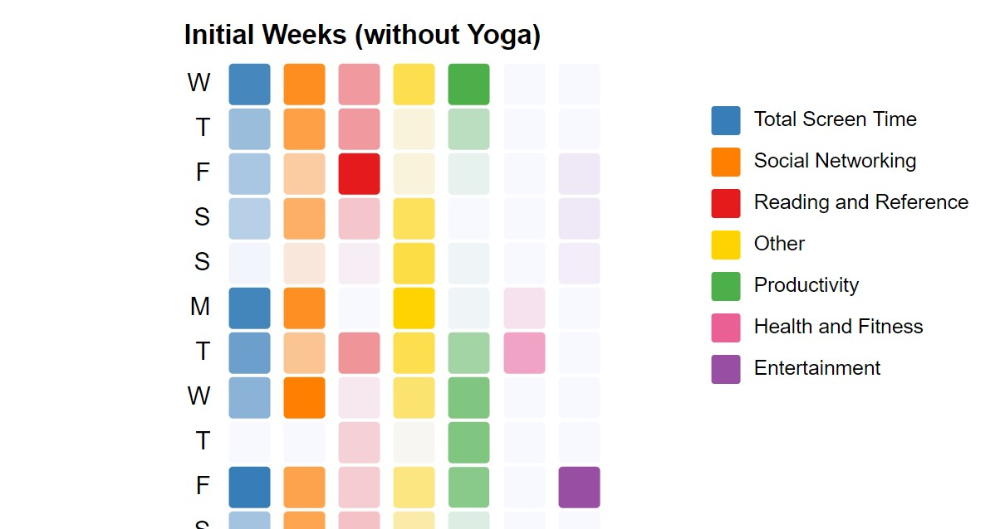

# Screen Time and Yoga
*The way we use technology dictates its effects on us.*

As a final project for a Data Visualization course, I designed an interactive visualization of a smartphone screen time data that's influenced by the practice of yoga. Check out the [report](doc/report.pdf) for more details on design and technical decisions!

## Setup
1. Clone the repository using `git clone`
2. `cd ScreenTimeYoga`
3. `cd src`
4. Launch a local http server, conveniently with `python -m http.server`
5. Open the URL (by default `localhost:8000`) on a browser (Chrome preferably), and navigate to `project.html`

## Data
The dataset done by Taylor L. Bailey was retrieved from [data.world](https://data.world/taylynners04/screen-time-data)
